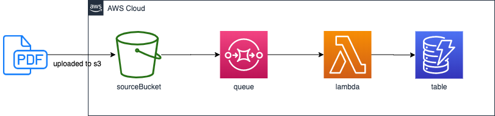

# S3-SQS-Lambda-DynamoDb Template

In this scenario a user uploads a PDF file to s3. This action sends an event to SQS, which then will trigger lambda function, that will store the metadata in dynamodb.

